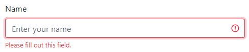

# Next.js with react-bootstrap and form validation

[Starting from this example](https://github.com/vercel/next.js/tree/canary/examples/with-react-bootstrap), this project was my experiment to see how form validation could be done easily and effectively with [React Bootstrap](https://react-bootstrap.netlify.app/) as the UI framework.

I tried two scenarios where my goal was to minimize complexity, tediousness, and stay as true to React/HTML5 as possible.

[React Hook Form](https://react-hook-form.com/) is minimally intrusive, easy to use, and is fairly flexible. With React Bootstrap it only worked with the "ref" approach using [register](https://react-hook-form.com/api#register). The [Controller](https://react-hook-form.com/api#Controller) approach didn't work for me. The downside to the "ref" approach is that I'm guessing it is using an uncontrolled strategy, which is [not recommended by React](https://reactjs.org/docs/uncontrolled-components.html).

The other approach, which I ended up preferring, was to use [React Bootstrap's support for native HTML5 validation](https://react-bootstrap.netlify.app/components/forms/#forms-validation-native). It was easy to activate and not surprisingly integrates more easily with Bootstrap's `Form.Control.Feedback` component. What really sold me on this approach is that HTML5 already provides a `validationMessage`, [described here](https://developer.mozilla.org/en-US/docs/Learn/Forms/Form_validation#Validating_forms_using_JavaScript), that conveys a helpful description of why the field is invalid. 

Here is the view of the required field after the initial form submission:



As typing characters, but still below the `minLength={3}` declaration:


Finally, when typing at least another character the rendering flips to a positive indication and feedback removal:


With that knowledge I wrapped up the potential repetition in a little helper component that paired a `Form.Control` with a `Form.Control.Feedback`. That helper component made use of the `validationMessage`, the `name` on the input, and the [`invalid` event](https://developer.mozilla.org/en-US/docs/Web/API/HTMLInputElement/invalid_event) fired by inputs during validation.

Using that helper component each input is about 10 lines, which is quite acceptable, for example:

```jsx
<ValidatedFormControl onChange={handleChange}
                    value={values.yourName}
                    name="yourName"
                    type="text" placeholder="Enter your name"
                    required
                    minLength={3}
/>
```

That `ValidatedFormControl` doesn't require much code itself:
```jsx
function ValidatedFormControl({
  value,
  onChange,
  ...props
}) {
  const [message, setMessage] = useState();
  const { controlId } = useContext(FormContext);

  return (
      <>
        <Form.Control {...props}
                      value={value}
                      onChange={event => {
                        onChange(event.target.value, event.target.name || controlId);
                        event.target.checkValidity();
                      }}
                      onInvalid={event => setMessage(
                          event.target.validationMessage)}
        />
        <Form.Control.Feedback type="invalid">
          {message}
        </Form.Control.Feedback>
      </>
  )
}
```

## Deploy your own

Deploy this project using [Vercel](https://vercel.com):

[](https://vercel.com/import/project?template=https://github.com/itzg/nextjs-bootstrap-validation)
